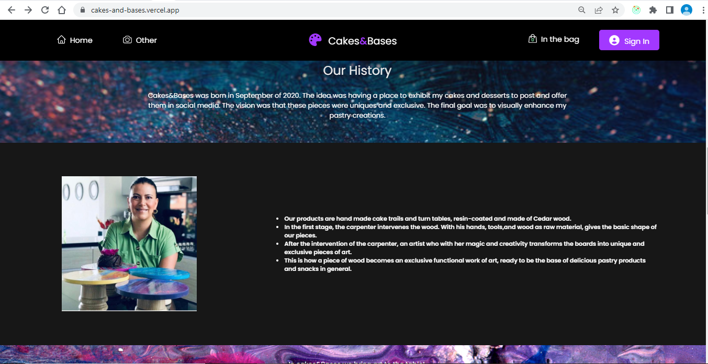
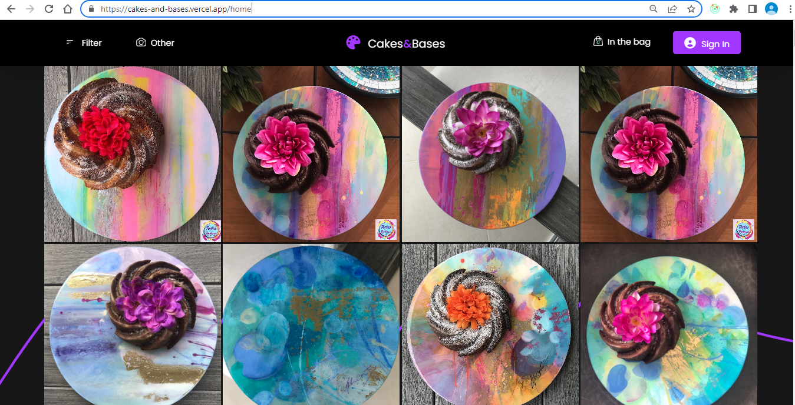
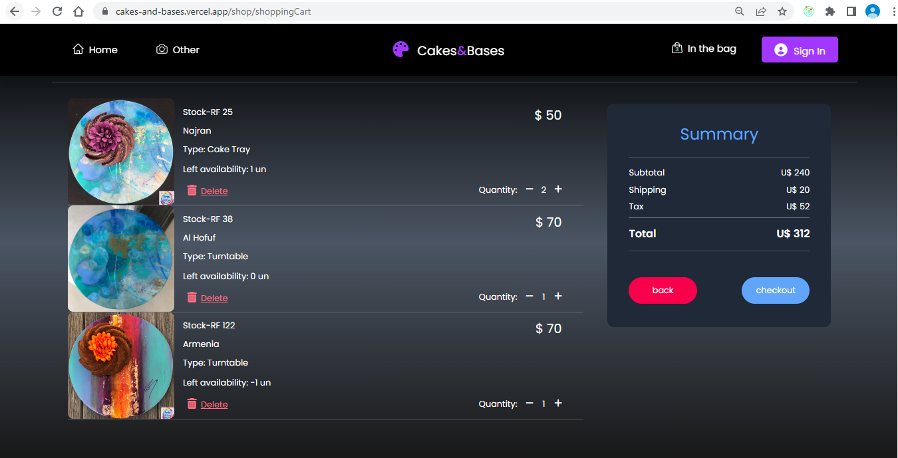
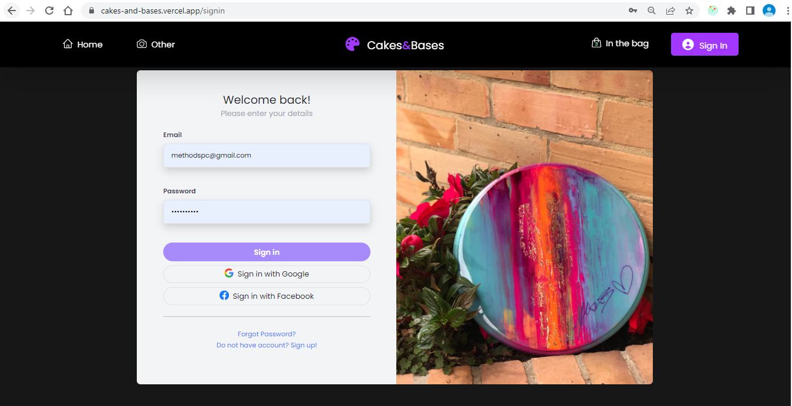
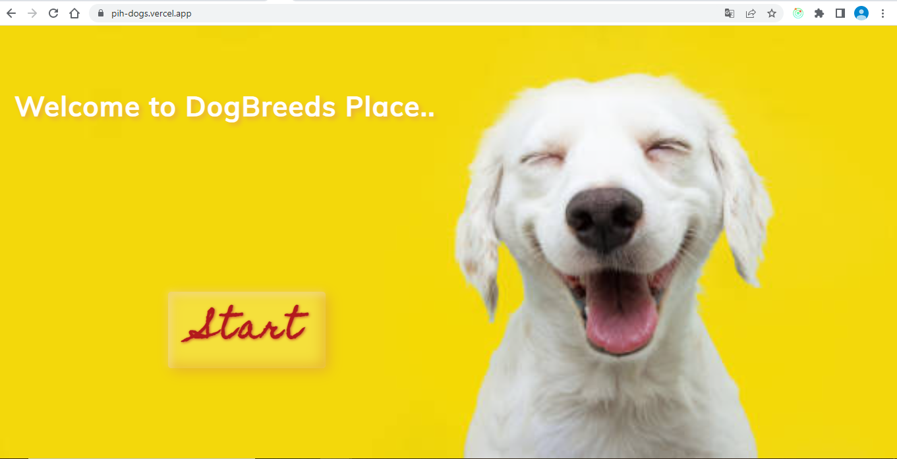
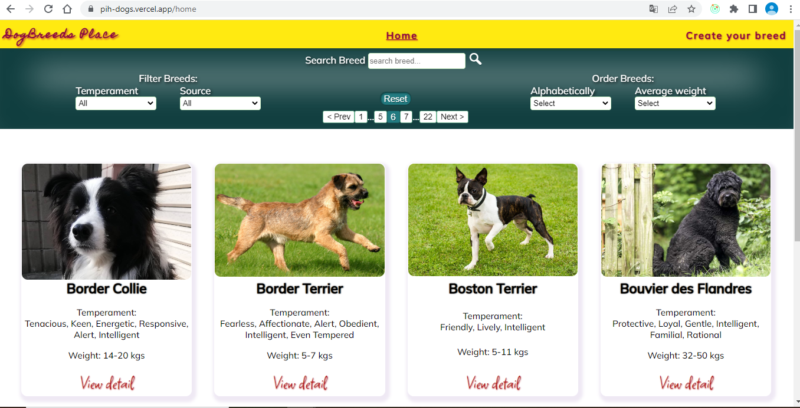

 
<h3> Hi! :wave: My name is Maria Eugenia Vogt. 
</h3>
 
I´m an accountant and graduated in business administration venturing into the exciting world of programming as a FullStack Developer. I acquired knowledge in JavaScript, NodeJS, Express, PostgreSQL, Sequelize, React, Redux, HTML, CSS and Scrum.

## :heavy_check_mark: Languajes and Tools

 

    
    
    
             
    
        
    
    
    
    
    
     

## :pushpin: My Projects

 

| Project               |                                                                                              Description                                                                                               |                                                                                                       Repo                                                                                                        |                                                 Link                                                 |
| --------------------- | :----------------------------------------------------------------------------------------------------------------------------------------------------------------------------------------------------: | :---------------------------------------------------------------------------------------------------------------------------------------------------------------------------------------------------------------: | :--------------------------------------------------------------------------------------------------: |
| E-commerce Cake-Bases |                                                     Web page developed with a work team, that allows the trade of cake bases painted by an artist.                                                     | <a href="https://github.com/andrespjm/tyt-frontend" target="_blank" rel="noreferrer">Front-end</a> <a href="https://github.com/andrespjm/tortas-y-torteras-backend" target="_blank" rel="noreferrer">Back-end</a> | <a href="https://cakes-and-bases.vercel.app/" target="_blank" rel="noreferrer">Deploy cake-bases</a> |
| Dog API               | Single-page application of dog breeds, which allows filtering, ordering and creation of new breeds, with the following technologies: JavaScript, HTML, CSS, react, Redux, Node, Sequelize, PostgreSQL. |                                                              <a href="https://github.com/MEugeV/PIDogs" target="_blank" rel="noreferrer">Proyect</a>                                                              |        <a href="https://pih-dogs.vercel.app" target="_blank" rel="noreferrer">Deploy dogs</a>        |

### Cakes and Bases

 

### Dogs

## :telephone: How to contact me

 

meugeniavogt@gmail.com 
+54 9 3516252960 
https://www.linkedin.com/in/mariaeugeniavogt/
